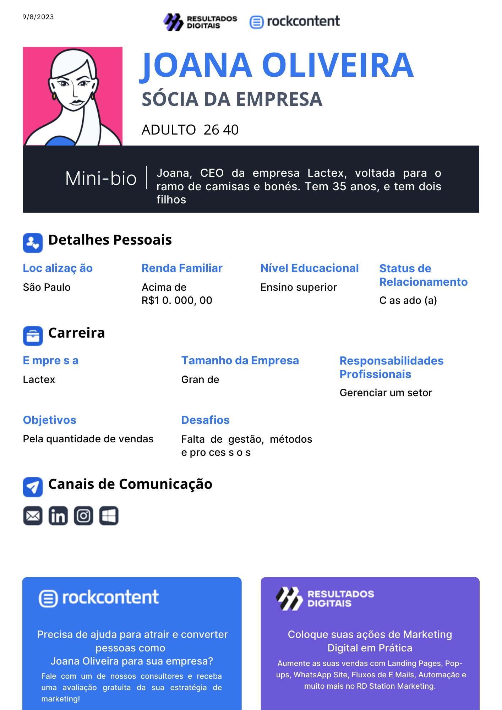

# Informações do Projeto
`SGN-Start Gamification Now`  
O Start Gamification Now - SGN, é um aplicativo de gerenciamento de tarefas que incorpora elementos de gamificação para tornar o processo de organização e conclusão de tarefas mais divertido e motivador. Através da implementação de recompensas, desafios, rankings e feedbacks, o projeto busca melhorar a produtividade, a qualidade do serviço, o relacionamento com clientes, a colaboração entre equipes, entre outros aspectos relevantes para o sucesso da empresa. O objetivo é ajudar os usuários a aumentar sua produtividade, alcançar metas pessoais e profissionais e transformar o gerenciamento de tarefas em uma experiência envolvente.

`SISTEMAS DE INFORMAÇÃO` 

## Participantes

> Os membros do grupo são: 
> - Fantine Bonfim
> - Emanuela Vitória Magalhães Alves
> - Gustavo Silva Miranda
> - João Vitor Oliveira Nishimoto
> - Maria Clara Nascimento
> - Gabriela Trindade Martins

# Estrutura do Documento

- [Informações do Projeto](#informações-do-projeto)
  - [Participantes](#participantes)
- [Estrutura do Documento](#estrutura-do-documento)
- [Introdução](#introdução)
  - [Problema](#problema)
  - [Objetivos](#objetivos)
  - [Justificativa](#justificativa)
  - [Público-Alvo](#público-alvo)
- [Especificações do Projeto](#especificações-do-projeto)
  - [Personas e Mapas de Empatia](#personas-e-mapas-de-empatia)
  - [Histórias de Usuários](#histórias-de-usuários)
  - [Requisitos](#requisitos)
    - [Requisitos Funcionais](#requisitos-funcionais)
    - [Requisitos não Funcionais](#requisitos-não-funcionais)
  - [Restrições](#restrições)
- [Projeto de Interface](#projeto-de-interface)
  - [User Flow](#user-flow)
  - [Wireframes](#wireframes)
- [Metodologia](#metodologia)
  - [Divisão de Papéis](#divisão-de-papéis)
  - [Ferramentas](#ferramentas)
  - [Controle de Versão](#controle-de-versão)
- [**############## SPRINT 1 ACABA AQUI #############**](#-sprint-1-acaba-aqui-)
- [Projeto da Solução](#projeto-da-solução)
  - [Tecnologias Utilizadas](#tecnologias-utilizadas)
  - [Arquitetura da solução](#arquitetura-da-solução)
- [Avaliação da Aplicação](#avaliação-da-aplicação)
  - [Plano de Testes](#plano-de-testes)
  - [Ferramentas de Testes (Opcional)](#ferramentas-de-testes-opcional)
  - [Registros de Testes](#registros-de-testes)
- [Referências](#referências)

# Introdução
Em um mundo cada vez mais dinâmico e acelerado, o desafio de gerenciar tarefas e manter-se produtivo nunca foi tão relevante. Diariamente, somos bombardeados por uma infinidade de responsabilidades, metas pessoais e profissionais, e é fácil sentir-se sobrecarregado. Mas e se pudéssemos transformar o ato de realizar tarefas em uma jornada envolvente e motivadora?
É com esse propósito que apresentamos o nosso projeto: o "SGN - Start Gamification Now". Imagine um aplicativo que não apenas ajuda você a organizar sua vida, mas também o incentiva a conquistar suas metas de maneira empolgante. Este projeto combina a eficiência do gerenciamento de tarefas com os elementos envolventes dos jogos para criar uma experiência única e altamente produtiva.
Nossa missão é redefinir a maneira como as pessoas abordam suas tarefas diárias, transformando a procrastinação em progresso, a procrastinação em produtividade e o estresse em diversão. Embarque nesta jornada conosco enquanto exploramos como o SGN pode ajudar você a alcançar mais, com menos esforço, e tornar o gerenciamento de tarefas uma aventura que você deseja embarcar todos os dias. Prepare-se para transformar suas tarefas em missões, seus objetivos em conquistas e sua vida em uma verdadeira "jogada" de produtividade!

## Problema

Em um cenário empresarial desafiador, uma organização enfrenta uma série de problemas que afetam sua eficiência e produtividade. Esses problemas abrangem várias áreas críticas, incluindo engajamento dos funcionários, motivação, comunicação interna e colaboração entre equipes.

Baixo Engajamento dos Funcionários: Um dos problemas mais urgentes é o baixo engajamento dos funcionários. Muitos colaboradores demonstram falta de entusiasmo e comprometimento com suas tarefas diárias. Isso resulta em uma queda na produtividade e na qualidade do trabalho, afetando a saúde geral da empresa.

Falta de Motivação para Realizar Tarefas: Além do engajamento, a falta de motivação é evidente. Os funcionários parecem desmotivados e não encontram significado em suas atividades. Isso cria um ambiente de trabalho onde o progresso é lento e as metas são difíceis de alcançar.

Comunicação Interna Ineficaz: A comunicação interna é outro desafio crítico. As informações não fluem eficazmente entre departamentos e equipes, resultando em mal-entendidos, duplicação de esforços e falta de alinhamento. Isso leva a projetos atrasados e erros evitáveis.

Falta de Colaboração entre Equipes: A colaboração entre equipes é fundamental para o sucesso de qualquer empresa, mas neste cenário, há uma falta de colaboração eficaz. As equipes operam em silos, não compartilhando conhecimento ou recursos de maneira eficiente. Isso prejudica a inovação e a resolução de problemas complexos.

Para superar esses desafios, a empresa precisa adotar uma abordagem estratégica. A gamificação pode ser uma solução eficaz para impulsionar o engajamento dos funcionários e a motivação, tornando as tarefas do dia a dia mais envolventes e gratificantes. Além disso, a gamificação pode ser estendida à comunicação interna, incentivando os funcionários a compartilhar informações e colaborar de maneira mais eficaz. Ao reconhecer e recompensar as contribuições valiosas, a empresa pode criar um ambiente mais produtivo e colaborativo, abordando assim esses desafios fundamentais e promovendo um ambiente de trabalho mais saudável e eficiente.

## Objetivos

> O nosso projeto tem como objetivo resolver a falta de motivação e engajamento em determinadas atividades de trabalho.
> Otimização de processos, coleta de dados estratégicos, redução do estresse na equipe, melhora na comunicação interna, melhora na motivação dos funcionários, impactando positivamente na produtividade dos colaboradores e criando um ambiente de trabalho mais interativo e divertido.

## Justificativa

A empresa, na qual dois membros do nosso grupo são colaboradores, identificou uma oportunidade há muito tempo desejada, mas até então não realizada: a implementação de um projeto de gamificação. Esta decisão reflete a visão da empresa em criar um ambiente de trabalho mais engajador e motivador para seus funcionários.

Segundo pesquisa feita pela Talent LMS:
- 89% dos funcionários se sentem mais produtivos e felizes com recursos gamificados no trabalho;
- 83% daqueles que recebem treinamento gamificado se sentem motivados, enquanto 61% dos que receberam treinamentos convencionais se sentem entediados e improdutivos;
- 89% acreditam que seriam mais produtivos caso sua rotina profissional fosse mais gamificada;
- 78% afirmam que a gamificação em processos de recrutamento torna a empresa mais desejável de se trabalhar.

> Indique as razões pelas quais você escolheu seus
> objetivos específicos ou as razões para aprofundar em certos aspectos
> do software.
> 
> O grupo de trabalho pode fazer uso de questionários, entrevistas e
> dados estatísticos, que podem ser apresentados, com o objetivo de
> esclarecer detalhes do problema que será abordado pelo grupo.
>

## Público-Alvo

> Profissionais em treinamento: Esses usuários podem incluir funcionários de empresas que estão participando de programas de treinamento ou desenvolvimento. Eles podem ter conhecimentos prévios sobre o assunto específico do treinamento, mas podem precisar de incentivo extra para se envolver ativamente e absorver o conteúdo de forma eficaz. Eles podem ser mais motivados por recompensas tangíveis, como promoções ou benefícios no local de trabalho.

> Líderes e gestores: Esses usuários podem estar interessados em usar a gamificação para motivar e envolver suas equipes no trabalho ou em outros contextos. Eles podem ter uma compreensão básica de como a gamificação pode ser aplicada para incentivar o desempenho e alcançar metas. Eles podem estar procurando maneiras de melhorar a produtividade, o trabalho em equipe e o engajamento de sua equipe.

# Especificações do Projeto

A definição exata do problema e os pontos mais relevantes a serem tratados neste projeto foram consolidados com a participação dos usuários, por meio de entrevistas com o dono da Engetak e pela experiência de dois membros do grupo que trabalham dentro da empresa. Os detalhes levantados nesse processo foram consolidados na forma de personas e histórias de usuários.

> Apresente uma visão geral do que será abordado nesta parte do
> documento, enumerando as técnicas e/ou ferramentas utilizadas para
> realizar a especificações do projeto

## Personas e Mapas de Empatia
Segue abaixo as personas:

Mapas de empatia:
Os mapas de empatia estão armazenados no link abaixo: 
https://github.com/ICEI-PUC-Minas-PBE-SI/pbe-si-ads-2023-2-tiaw-t2-gamification/blob/3afc6ca891aa65e1c19c5d5f0d2b54303aec7791/Mapas%20de%20Empatia.pdf

## Histórias de Usuários

Segue as histórias de usuarios: 
As histórias de usuarios estãon armazanadas no link abaixo: 
https://github.com/ICEI-PUC-Minas-PBE-SI/pbe-si-ads-2023-2-tiaw-t2-gamification/blob/c39f96f1078b767c616799f11e567257dffde04a/docs/historiadeusuario%20(1).pdf

## Requisitos

As tabelas que se seguem apresentam os requisitos funcionais e não funcionais que detalham o escopo do projeto.

### Requisitos Funcionais

|ID    | Descrição do Requisito  | Prioridade |
|------|-----------------------------------------|----|
|RF-001| O sistema deve fazer cadastro de Usuário (ADM e FUNCIONÁRIO) | ALTA | 
|RF-002| O sistema deve conter lista de Tarefas e Objetivos           | ALTA |
|RF-003| O sistema deve conter Sistema de Pontuação e Ranking         | ALTA |
|RF-004| O sistema deve conter  Sistema de Recompensas                | ALTA |

### Requisitos não Funcionais

|ID     | Descrição do Requisito  |Prioridade |
|-------|-------------------------|----|
|RNF-001| A interface deve cumprir com a paleta de cores da empresa | MÉDIA | 
|RNF-002| A interface deve ser simples e de fácil compreensão para os funcionário |  ALTA | 
|RNF-003| O Sistema deve ser compatível com Notebooks|  ALTA |
|RNF-004| O Sistema deve ser de fácil manutenção e atualização |  ALTA |
|RNF-005|O Sistema deve ser sustentavel: Minimizar o consumo de recursos, como energia e largura de banda |  MÉDIA |
|RNF-006| O Sistema deve ser  rápido e de fácil acesso |  ALTA |
|RNF-006| O Sistema deve conter Segurança de dados|  ALTA |

## Restrições

O projeto está restrito pelos itens apresentados na tabela a seguir.

|ID| Restrição                                             |
|--|-------------------------------------------------------|
|01| O projeto deverá ser entregue até o final do semestre |
|02| O projeto deve ser desenvolvido por até 6 pessoas     |

# Projeto de Interface

> As principais interfaces da nossa solução são a página de login, a página em que irá ficar o gerenciamento de tarefas(para que o usuário saiba quais tarefas estão pendentes, em execução ou se já foram concluídas, e também o perfil do usuário, que é onde ele irá consultar sua pontuação e suas tarefas concluidas ou em falta.
> 
## User Flow

> **Exemplo**:
> 

## Wireframes

> 
> 

# Metodologia

Primeiramente, foi criado um grupo no WhatsApp para facilitar a comunicação dos integrantes do grupo. Posteriormente, foi feita uma reunião inicial onde um dos membros apresentou a ideia, as expectitivas e um escopo de como seria o projeto. Cada um mostrou suas habilidades e dividimos em partes: Código, Estratégia e Design. Usaremos o VSCode para codificação do projeto, o Discord para reuniões e alinhamentos Online e o Notion para a divisão de tarefas e visualizador de problemas e soluções.

O quadro kanban do grupo no Notion está disponível através da URL https://concrete-viscose-e91.notion.site/41a70623dfcc4075af9a4ba62acd67ac?v=4686fcedd3054d05981c88b2bb2b09db

## Divisão de Papéis

Emanuela Alves - Desenvolvimento da págiina de login
Fantine Bonfim - Desenvolvimento da págiina de perfil 
Gabriela Trindade - Desenvolvimento da págiina de tarefas
Gustavo Miranda - Desenvolvimento da págiina de ranking
Maria Clara Nascimento - Desenvolvimento da págiina de perfil
João Vitor Nishimoto - Desenvolvimento da págiina de recompensas

## Ferramentas

| Ambiente  | Plataforma              |Link de Acesso |
|-----------|-------------------------|---------------|
|Processo de Design Thinkgin  | Miro |  https://miro.com/XXXXXXX | 
|Repositório de código | GitHub | https://github.com/XXXXXXX | 
|Hospedagem do site | Heroku |  https://XXXXXXX.herokuapp.com | 
|Protótipo Interativo | MavelApp ou Figma | https://figma.com/XXXXXXX | 

> As ferramentas empregadas no projeto são:
> 
> - Visual Studio Code
> - Repl.it
> - Notion
> - Git Hub
> 
> O editor de código foi escolhido porque ele possui uma integração com o
> sistema de versão. As ferramentas de comunicação utilizadas possuem
> integração semelhante e por isso foram selecionadas. Por fim, para criar
> diagramas utilizamos essa ferramenta por melhor captar as
> necessidades da nossa solução.

## Controle de Versão

......  COLOQUE AQUI O SEU TEXTO ......

> Discuta como a configuração do projeto foi feita na ferramenta de
> versionamento escolhida. Exponha como a gerência de tags, merges,
> commits e branchs é realizada. Discuta como a gerência de issues foi
> realizada.
> A ferramenta de controle de versão adotada no projeto foi o
> [Git](https://git-scm.com/), sendo que o [Github](https://github.com)
> foi utilizado para hospedagem do repositório `upstream`.
> 
> O projeto segue a seguinte convenção para o nome de branchs:
> 
> - `master`: versão estável já testada do software
> - `unstable`: versão já testada do sof********************tware, porém instável
> - `testing`: versão em testes do software
> - `dev`: versão de desenvolvimento do software
> 
> Quanto à gerência de issues, o projeto adota a seguinte convenção para
> etiquetas:
> 
> - `bugfix`: uma funcionalidade encontra-se com problemas
> - `enhancement`: uma funcionalidade precisa ser melhorada
> - `feature`: uma nova funcionalidade precisa ser introduzida
>
> **Links Úteis**:
> - [Tutorial GitHub](https://guides.github.com/activities/hello-world/)
> - [Git e Github](https://www.youtube.com/playlist?list=PLHz_AreHm4dm7ZULPAmadvNhH6vk9oNZA)
> - [5 Git Workflows & Branching Strategy to deliver better code](https://zepel.io/blog/5-git-workflows-to-improve-development/)
>
> **Exemplo - GitHub Feature Branch Workflow**:
>
> 

# **############## SPRINT 1 ACABA AQUI #############**

# Projeto da Solução

......  COLOQUE AQUI O SEU TEXTO ......

## Tecnologias Utilizadas
> HTML 
> CSS
> JS
> JSON
> JSONServer
> localStorage

## Arquitetura da solução

......  COLOQUE AQUI O SEU TEXTO E O DIAGRAMA DE ARQUITETURA .......

> Inclua um diagrama da solução e descreva os módulos e as tecnologias
> que fazem parte da solução. Discorra sobre o diagrama.
> 
> **Exemplo do diagrama de Arquitetura**:
> 
> 

# Avaliação da Aplicação

......  COLOQUE AQUI O SEU TEXTO ......

> Apresente os cenários de testes utilizados na realização dos testes da
> sua aplicação. Escolha cenários de testes que demonstrem os requisitos
> sendo satisfeitos.

## Plano de Testes

Utilizamos a empresa Engetak para testar a plataforma. Deixamos em ativa por
1 semana e explicamos como utilizar. Encontramos dificuldades, pois alguns
usuários estavam desaparecendo, e algumas pessoas estavam clicando mais de uma 
vez nas tarefas e pegando mais pontos do que deviam, e alguns sem querer. Outro
problema foi no cadastro de usuário, pois colocamos uma função no botão errado,
mas rapidamente resolvemos o problema.

## Ferramentas de Testes (Opcional)

Utilizamos o VSCode para testar e fomos dando reset na página, junto com o 
console.log para identificarmos problemas. 

## Registros de Testes

Durante o período de testes, o maior problema foi na gestão do banco de dados
e a manipulação dos objetos. Objetos sumindo, alterando de forma incorreta e
adição de objetos a mais. Um outro problema, foi a escrita em json, que desgastou
bastante, pois o banco de dados não funcionava. Fomos executando testes até que
conseguimos chegar em um ponto estável, e criamos uma cópia do arquivo em .zip.
No final, conseguimos manipular, adicionando, alterando e deletando usuários.

# Referências

Utilizamos o método de Gamificação da empresa ioasys como referência
